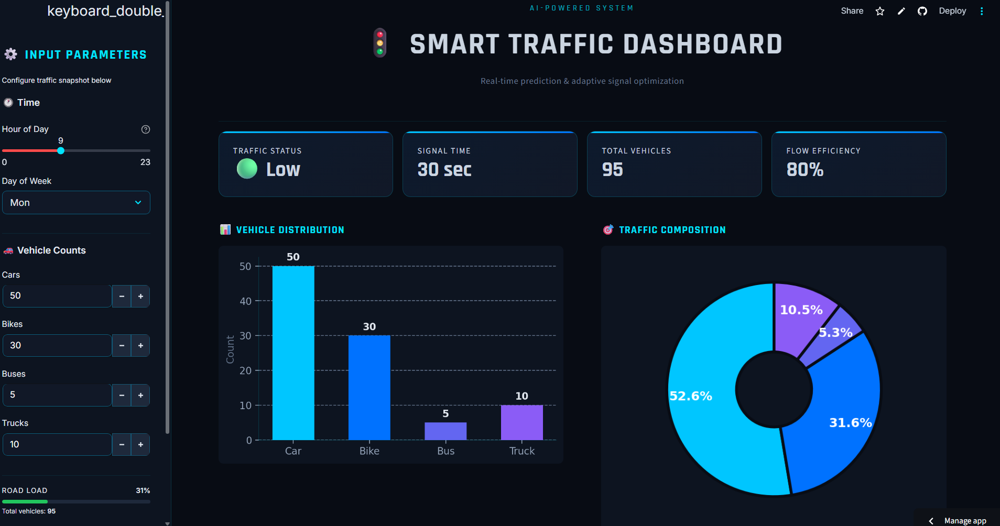
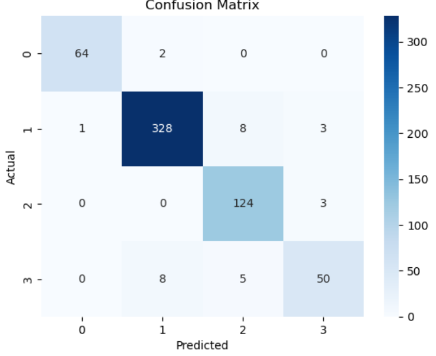
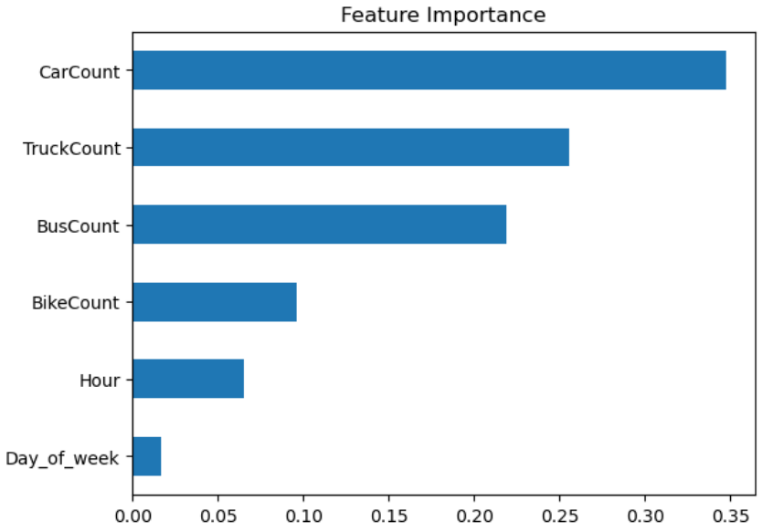

# 🚦 Smart Traffic Dashboard

A simple idea: traffic signals shouldn’t behave the same way all the time.

This project builds a smart, data-driven traffic management system that predicts congestion levels and adjusts signal timings accordingly. Instead of fixed timers, it reacts to actual traffic conditions — making roads flow a little better.

---

## 📌 What This Project Does

* Predicts traffic level based on vehicle counts and time
* Classifies traffic into: **Low, Normal, Heavy, High**
* Dynamically suggests **signal timing**
* Provides an **interactive dashboard** to visualize traffic
* Includes a **live simulation** to mimic real-time conditions

---

## 🧠 Why This Matters

Most traffic signals today follow fixed timing.
They don’t care if a road is empty or overloaded.

That leads to:

* Unnecessary waiting
* Growing vehicle queues
* Wasted fuel
* Frustration

This project tries to fix that — not by eliminating traffic, but by **managing it smarter**.

---

## ⚙️ How It Works

### 1. Input Data

The system takes:

* Hour of the day
* Day of the week
* Number of cars, bikes, buses, and trucks

---

### 2. Feature Engineering

* Total vehicle count is calculated
* Time features are structured for prediction

---

### 3. Machine Learning Model

* Uses **Random Forest Classifier**
* Trained to classify traffic levels

---

### 4. Hybrid Logic (Important)

Some extreme cases aren’t well represented in data.

So we add rules like:

```text
If total vehicles > 220 → High traffic
If total vehicles > 160 → Heavy traffic
```

This makes the system more reliable in real-world scenarios.

---

### 5. Output

The system returns:

* Traffic condition
* Suggested signal timing

---

## 📊 Dashboard Features

* 📈 Traffic prediction display
* 📊 Vehicle distribution charts
* 🧠 Feature importance visualization
* 📡 Live traffic simulation
* 🚦 Signal timing recommendations

---

## 🛠 Tech Stack

* **Python**
* **Streamlit** (UI Dashboard)
* **Scikit-learn** (Machine Learning)
* **Pandas & NumPy** (Data Processing)
* **Matplotlib** (Visualization)

---

## 🚀 How to Run Locally

### 1. Clone the repository

```bash
git clone https://github.com/your-username/your-repo-name.git
cd your-repo-name
```

### 2. Install dependencies

```bash
pip install -r requirements.txt
```

### 3. Run the app

```bash
streamlit run app.py
```

---

## 🌐 Deployment

The app is deployed using **Streamlit Cloud**.

👉 Just open the link and it runs in your browser — no setup needed.

https://trafficdashboard8688.streamlit.app/

---

## 📸 Project Preview

### 🚦 Dashboard

<p align="center">
  
</p>

---

### 📊 Confusion Matrix

<p align="center">
  
</p>

---

### 🧠 Feature Importance

<p align="center">
  
</p>

## ⚠️ Limitations

Let’s be real:

* Uses limited dataset (1 month)
* Works for single intersection (not multi-road system)
* Doesn’t handle accidents or real-time sensor data
* Depends on input quality

---

## 🔮 Future Improvements

* Real-time traffic data integration (IoT / APIs)
* Multi-intersection coordination
* Deep learning models for better prediction
* Camera-based vehicle detection (YOLO)

---

## 🎯 Final Thought

This project doesn’t eliminate traffic.

It simply asks:

> *Can we make traffic signals a little smarter?*

---

## 📚 References

* IEEE Research Papers on Traffic Optimization
* Scikit-learn Documentation
* Streamlit Documentation

---

## 👨‍💻 Author

**Karthik**
B.Tech – Computer Science (Data Science)

---

